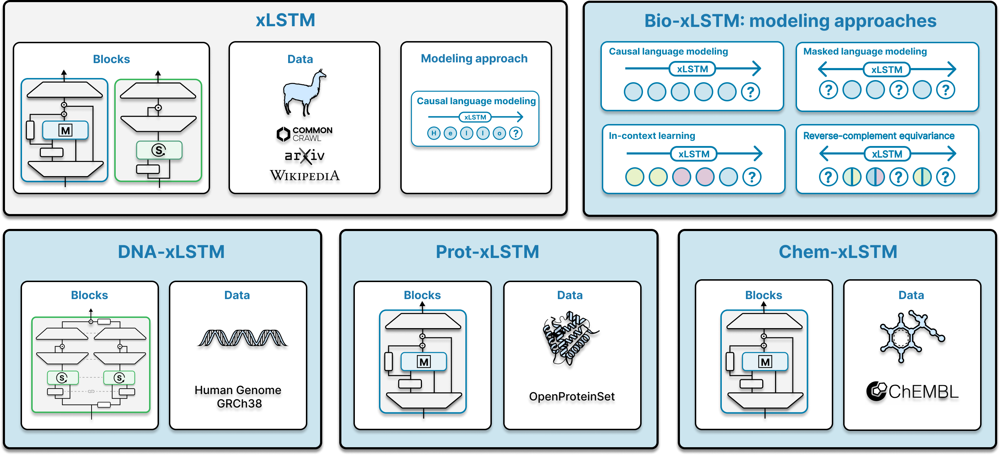

<p align="center">
    
</p>

# Bio-xLSTM: Generative modeling, representation and in-context learning of biological and chemical sequences

This repository provides the code necessary to reproduce the experiments presented in the paper [Bio-xLSTM: Generative modeling, representation and in-context learning of biological and chemical sequences](TODO arxiv link). Experimental results are organized across the following repositories:

- [DNA-xLSTM](https://github.com/ml-jku/DNA-xLSTM/)
- [Prot-xLSTM](https://github.com/ml-jku/Prot-xLSTM/)
- [Chem-xLSTM](https://github.com/ml-jku/Chem-xLSTM/) (current repository) 

## Chem-xLSTM

Chem-xLSTM codebase is currently under construction and will be released soon.

### Citation

```latex
@article{schmidinger2024bio-xlstm,
  title={{Bio-xLSTM}: Generative modeling, representation and in-context learning of biological and chemical  sequences},
  author={Niklas Schmidinger and Lisa Schneckenreiter and Philipp Seidl and Johannes Schimunek and Pieter-Jan Hoedt and Johannes Brandstetter and Andreas Mayr and Sohvi Luukkonen and Sepp Hochreiter and Günter Klambauer},
  journal={arXiv},
  doi = {},
  year={2024},
  url={}
}
```
